<div align="center">

# 🧠 Recall

### A private, on-device-first AI notebook for Android

_Capture anything → understand it on your phone → **ask your own knowledge** (RAG)._

[](https://developer.android.com)
[](https://kotlinlang.org)
[](https://developer.android.com/jetpack/compose)
[](https://m3.material.io)
[](https://developer.android.com)
[](https://developer.android.com)

<br/>

**🧠 AI capabilities**

[](https://ai.google.dev/edge)
[](https://ai.google.dev)
[](https://ai.google.dev)
[](https://developer.android.com/privacy)
[](https://ai.google.dev)

**🔧 AI engines**

[](https://developers.google.com/ml-kit)
[-FF6F00?logo=tensorflow&logoColor=white)](https://ai.google.dev/edge/litert)
[](https://ai.google.dev/edge/mediapipe)
[](https://developer.android.com/ai/gemini-nano)
[](https://ai.google.dev)

</div>

---

## 📖 Table of contents

- [What is Recall?](#-what-is-recall)
- [Why it exists](#-why-it-exists)
- [What Recall covers](#-what-recall-covers)
- [Key features](#-key-features)
- [Screens](#-screens)
- [Architecture](#-architecture)
- [Module graph](#-module-graph)
- [Capture & ingest pipeline](#-capture--ingest-pipeline)
- [On-device AI stack](#-on-device-ai-stack)
- [The intelligence layer](#-the-intelligence-layer-what-makes-it-smart)
- [RAG pipeline](#-rag-pipeline)
- [RAG variants](#-rag-variants)
- [Agent tool loop](#-agent-tool-loop)
- [On-device vs cloud routing](#-on-device-vs-cloud-routing)
- [Model lifecycle](#-model-lifecycle)
- [Privacy & PII redaction flow](#-privacy--pii-redaction-flow)
- [Evaluation harness](#-evaluation-harness)
- [Tech stack](#-tech-stack)
- [Project structure](#-project-structure)
- [Getting started](#-getting-started)
- [Configuration](#-configuration)
- [Build & run](#-build--run)
- [Quality & evaluation](#-quality--evaluation)
- [Privacy & security](#-privacy--security)
- [Roadmap](#-roadmap)
- [Competency map](#-competency-map-learning-goals)
- [Contributing](#-contributing)
- [License](#-license)

---

## 🧩 What is Recall?

**Recall** is a personal knowledge notebook that captures photos, text, voice, and PDFs,
understands them **on the device** (OCR, transcription, tagging, embeddings), and lets you
**ask questions grounded in your own notes** using Retrieval-Augmented Generation (RAG).

It is **on-device first**: everything that _can_ run locally _does_ run locally, for privacy,
offline access, and zero cost. The cloud is used only when a task genuinely needs heavier
reasoning — and even then, only free-tier models.

> Think of it as your "second brain" that lives on your phone, respects your privacy, and
> actually reasons over what you feed it.

---

## 🎯 Why it exists

Recall is both a **real product** and a **structured learning project** to grow from
**Android engineer → Mobile AI engineer**. Every feature is chosen because it forces a real
mobile-AI engineering decision (on-device vs cloud, latency vs quality, privacy vs power),
not because it looks flashy.

That means the codebase demonstrates the full production surface of modern on-device AI:
capture pipelines, custom model inference, embeddings + vector search, RAG orchestration,
agentic tool-calling, routing, evaluation harnesses, and observability.

---

## 🗺 What Recall covers

The whole Mobile-AI surface area, mapped to one product:

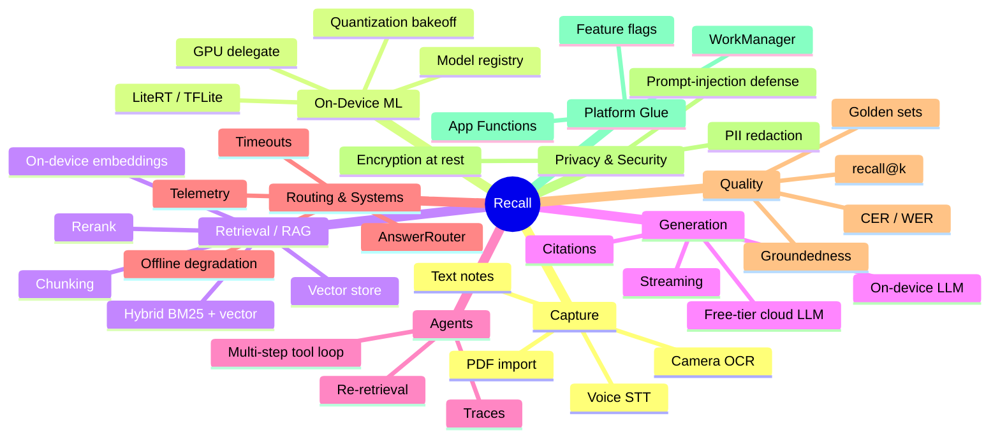

---

## ✨ Key features

| Area | Capability |
|------|------------|
| 📸 **Capture** | Camera scan with **on-device OCR**, voice memos with **on-device transcription**, quick text notes, PDF import |
| 🏷️ **Understand** | **Auto-tagging** via a custom LiteRT model, **on-device embeddings** for every note |
| 🔎 **Search** | Fully offline **semantic search** ("find that thing about invoices") + hybrid keyword search |
| 💬 **Ask** | **"Ask my notes"** RAG chat with streaming answers, cancel-in-flight, and **source citations** |
| 🧠 **Summarize** | On-device note summaries (Gemini Nano / on-device LLM) |
| 🤖 **Agents** | Multi-step tool-calling agent (plan → tool → observe) with visible traces |
| 🔊 **Read aloud** | On-device neural text-to-speech |
| 🧪 **AI Lab** | Model status, latency/quantization bakeoffs, RAG traces, and evaluation scores |
| 🔐 **Private** | Encryption at rest, PII redaction before any cloud call, export/delete your data |

---

## 📱 Screens

| # | Screen | Purpose |
|---|--------|---------|
| 1 | Onboarding | Privacy-first value proposition |
| 2 | Home / Library | Scrollable list of notes with filters |
| 3 | Capture hub | Choose input type (scan / voice / text / PDF) |
| 4 | Camera OCR | Live scanning with on-device text recognition |
| 5 | Voice memo | Record + live on-device transcript |
| 6 | Note editor | View/edit note, summarize, ask, read aloud |
| 7 | Semantic search | Meaning-based search over your notes |
| 8 | Ask AI | RAG chat with citations + on-device/cloud badge |
| 9 | AI summary sheet | On-device generated summary |
| 10 | Settings | AI mode, model status, privacy controls |
| 11 | **AI Lab** | Benches, bakeoffs, RAG traces, eval dashboard |

---

## 🏛 Architecture

Recall follows **clean, unidirectional, multi-module architecture**:

```
UI (Compose)  →  ViewModel (StateFlow)  →  UseCase  →  Repository  →  AI / Remote / DB
```

Principles:

- **Compose + Material 3** for all UI — no XML View screens.
- **Unidirectional data flow**: ViewModels expose immutable `StateFlow<UiState>`; UI is stateless.
- **Inference never on the main thread** — `Dispatchers.Default`/`IO` or `WorkManager`.
- **Repositories are the only gateway** to data; features never touch `:data:remote` or `:data:ai` directly.
- **`AnswerRouter`** owns the on-device-vs-cloud decision — no feature hardcodes "call the cloud".
- **Domain models are pure Kotlin** (`:core:model` has no Android dependencies).

---

## 🗂 Module graph

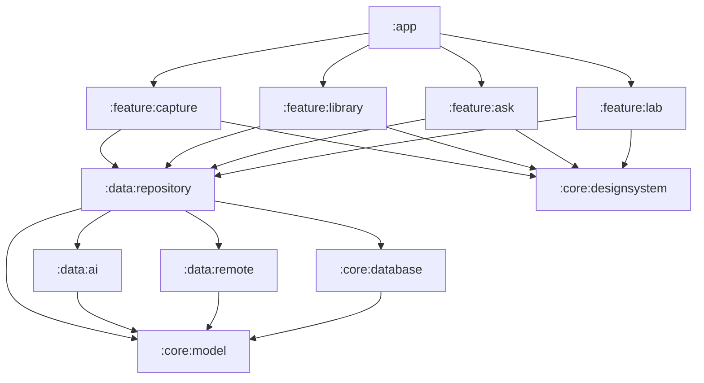

| Module | Responsibility |
|--------|----------------|
| `:app` | Navigation, DI wiring, theme, app entry point |
| `:core:model` | Pure-JVM domain models (no framework deps) |
| `:core:designsystem` | Material 3 theme, tokens, shared composables |
| `:core:database` | Room entities, DAOs, vector store, encryption |
| `:data:ai` | On-device inference: OCR, STT, embeddings, LiteRT, on-device LLM |
| `:data:remote` | Free-tier cloud LLM client (Gemini) + streaming |
| `:data:repository` | Repositories, `AnswerRouter`, RAG assembly |
| `:feature:capture` | Camera / OCR / voice / text / PDF capture |
| `:feature:library` | Notes list + semantic search |
| `:feature:ask` | RAG chat + agent loop UI |
| `:feature:lab` | AI Lab: benches, bakeoffs, traces, evals |

---

## 📥 Capture & ingest pipeline

Every input type is normalized into a **searchable, embeddable note** — mostly on-device.

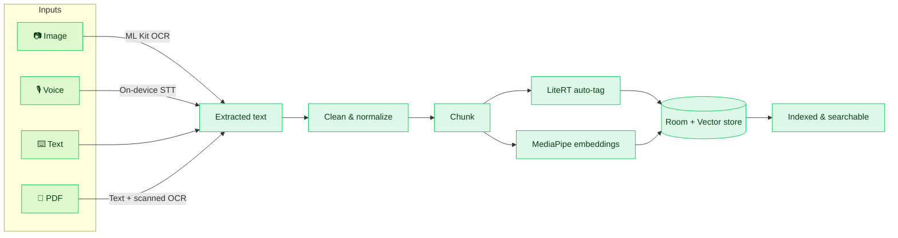

> 🟢 Green = runs **fully on-device**. The entire ingest path works offline with zero cloud calls.

---

## 📱 On-device AI stack

How the on-device intelligence is layered, from hardware up to features:

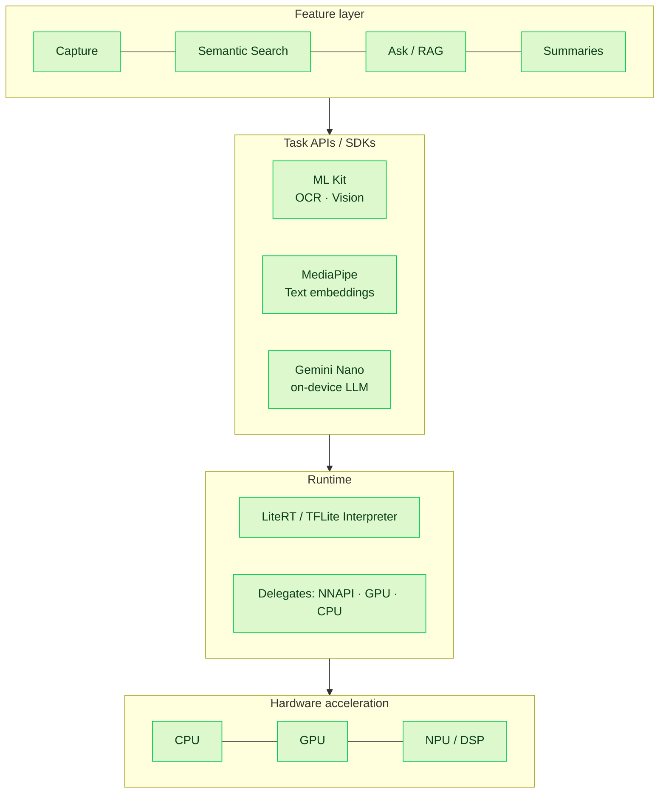

| Layer | What it does | Tech |
|-------|--------------|------|
| Feature | User-facing intelligence | Compose screens |
| Task APIs | High-level ready models | ML Kit, MediaPipe, Gemini Nano |
| Runtime | Executes custom models | LiteRT (TFLite) + delegates |
| Hardware | Accelerates inference | CPU / GPU / NPU |

---

## 🤖 The intelligence layer (what makes it smart)

Recall is "smart" because intelligence is layered, measurable, and routed — not a single API call.

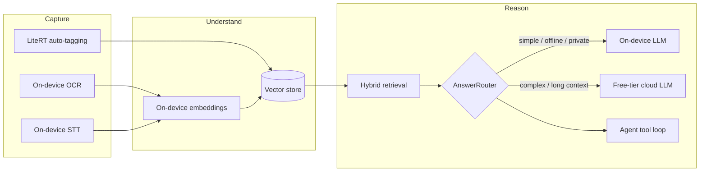

Capabilities that make it intelligent:

- **Multimodal capture** — text extracted from images (OCR) and speech (STT), all on-device.
- **Semantic understanding** — every note is embedded into a vector for meaning-based retrieval.
- **Grounded answers** — the model only answers from _your_ notes, and cites its sources.
- **Agentic reasoning** — for complex asks, a multi-step agent can call tools (filter, open note, create reminder) and re-retrieve mid-loop.
- **Self-measuring** — an evaluation harness proves retrieval and answer quality instead of guessing.

---

## 🔗 RAG pipeline

Every "Ask my notes" query runs the same grounded pipeline:

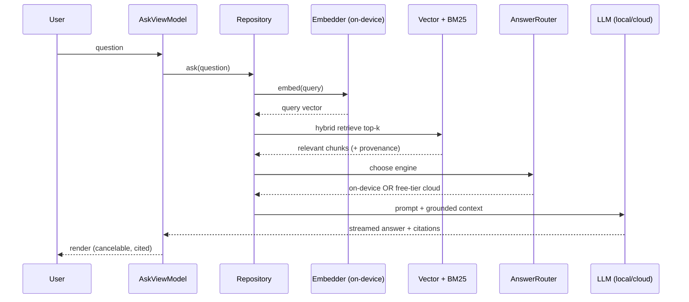

1. **Embed** the query on-device.
2. **Retrieve** top-k with hybrid **BM25 + vector** search (with tag/time filters).
3. **Assemble** a grounded context preserving chunk → note/page provenance.
4. **Route** to on-device or free-tier cloud via `AnswerRouter`.
5. **Stream** the answer with **structured citations** and cancel-in-flight support.
6. **Log** route/latency/cost and **evaluate** groundedness + recall@k.

---

## 🧬 RAG variants

Recall implements four flavors of RAG, each exercising a different engineering skill:

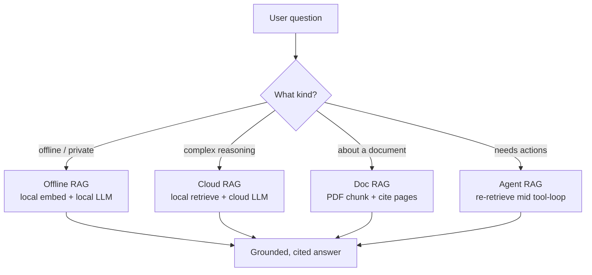

| Variant | Retrieval | Generation | Highlights |
|---------|-----------|------------|-----------|
| **Offline RAG** | on-device | on-device LLM | Works in airplane mode, fully private |
| **Cloud RAG** | on-device | free-tier cloud | Heavy reasoning, long context |
| **Doc RAG** | PDF chunks | local/cloud | Page-level citations for documents |
| **Agent RAG** | re-retrieved | local/cloud | Re-queries knowledge inside the tool loop |

---

## 🛠 Agent tool loop

For complex asks, a multi-step agent **plans → calls a tool → observes → repeats** until it can answer:

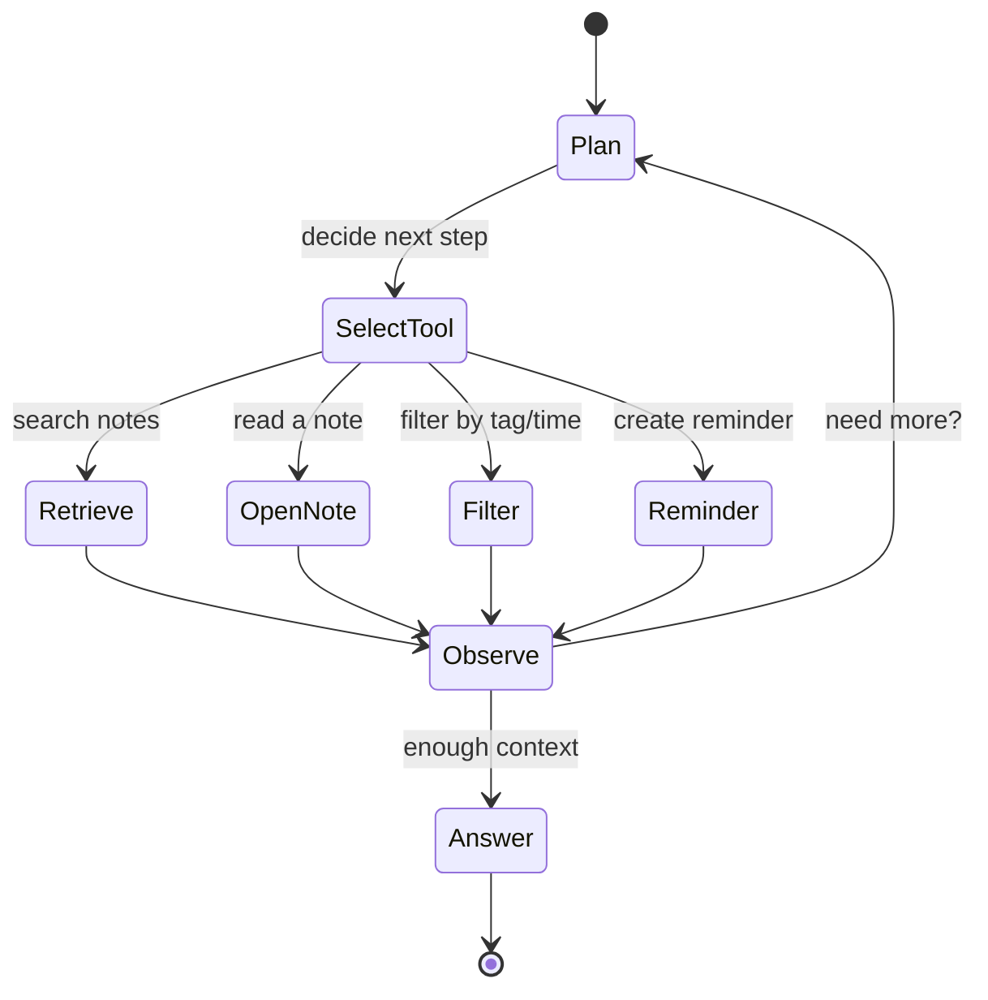

Every step is recorded as a **trace** (tool, input, output, latency) and shown in the **AI Lab**,
with guardrails that block unsafe tool calls.

---

## 🧭 On-device vs cloud routing

`AnswerRouter` (in `:data:repository`) decides per query:

| Prefer **on-device** when… | Escalate to **free-tier cloud** when… |
|----------------------------|----------------------------------------|
| Offline / airplane mode | Complex multi-note reasoning |
| Short / simple query | Long context windows |
| Privacy-sensitive content | Hard multimodal understanding |
| Low latency required | Multi-step agent planning |

Every decision is logged with measured latency and cost, and surfaced in the **AI Lab**.

> 💡 **Budget rule:** cloud is only used when the device genuinely cannot do the job, and only
> with free-tier models. No paid subscription is required to run Recall.

---

## 📦 Model lifecycle

On-device models are versioned, downloaded on demand, and benchmarked before they ship to users:

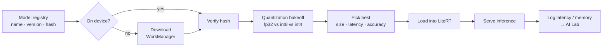

The **quantization bakeoff** compares model variants on **size vs latency vs accuracy** and records
the tradeoff so the choice is defensible, not arbitrary.

---

## 🔐 Privacy & PII redaction flow

Nothing leaves the device without passing through the privacy gate:

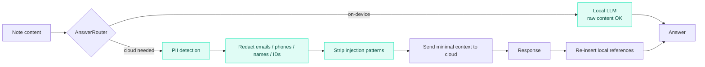

Layers: **encryption at rest** → **PII redaction** before cloud → **prompt-injection sanitization**
of retrieved content → **export/delete** controls in Settings.

---

## 📊 Evaluation harness

Quality is proven with numbers, not vibes. Each capability runs against a **golden set** and gates CI:

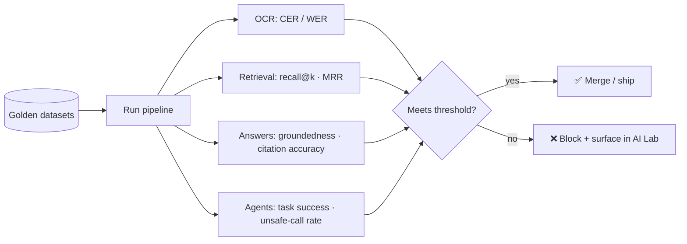

---

## 🛠 Tech stack

All versions are centralized in the **Gradle Version Catalog** ([`gradle/libs.versions.toml`](gradle/libs.versions.toml)).

### Core
- **Kotlin** `2.2.10` · **AGP** `9.3.1` · **Coroutines / Flow**
- **Jetpack Compose** (BOM `2026.02.01`) · **Material 3** · **Navigation Compose**
- **Hilt** (DI) · **Room** (DB) · **DataStore** (settings) · **WorkManager** (background) · **Coil** (images)

### On-device AI
- **CameraX** — camera pipeline
- **ML Kit Text Recognition** — OCR
- **ML Kit Image Labeling** — vision tagging
- **LiteRT (TensorFlow Lite)** + **GPU delegate** — custom model inference
- **MediaPipe Tasks (Text)** — on-device embeddings
- On-device LLM — summaries (Gemini Nano / MediaPipe LLM)

### Cloud AI (free-tier)
- **Google Generative AI (Gemini)** — heavy reasoning / multimodal
- **Retrofit + OkHttp + Kotlinx Serialization** — networking & structured output

### Quality
- **JUnit** · **Truth** · **Compose UI Test** · **Espresso**

---

## 📁 Project structure

```
Recall/
├── app/                      # Application module (entry point, navigation, DI graph)
├── core/
│   ├── model/                # Pure-JVM domain models
│   ├── designsystem/         # Material 3 theme + shared composables
│   └── database/             # Room + vector store + encryption
├── data/
│   ├── ai/                   # On-device inference (OCR, STT, embeddings, LiteRT, LLM)
│   ├── remote/               # Free-tier Gemini client + streaming
│   └── repository/           # Repositories + AnswerRouter + RAG assembly
├── feature/
│   ├── capture/              # Camera / OCR / voice / text / PDF capture
│   ├── library/              # Notes list + semantic search
│   ├── ask/                  # RAG chat + agent loop
│   └── lab/                  # AI Lab (benches, bakeoffs, traces, evals)
├── gradle/
│   └── libs.versions.toml    # Single source of truth for versions
├── build.gradle.kts          # Root build config
└── settings.gradle.kts       # Module includes
```

---

## 🚀 Getting started

### Prerequisites

- **Android Studio** (latest stable, with AGP 9.x support)
- **JDK 11+**
- An Android device or emulator running **Android 7.0 (API 24)** or higher
- _(Optional)_ A free **Gemini API key** for cloud RAG features

### Clone

```bash
git clone <your-repo-url> Recall
cd Recall
```

---

## ⚙️ Configuration

Cloud features are optional. To enable free-tier Gemini, add your key to `local.properties`
(this file is **git-ignored** — never commit secrets):

```properties
# local.properties
GEMINI_API_KEY=your_free_tier_key_here
```

It is then exposed to the app via `BuildConfig` (wired in the app module). Without a key,
Recall still runs fully **on-device** (capture, OCR, STT, embeddings, semantic search, on-device summaries).

---

## 🔨 Build & run

```bash
# Build a debug APK
./gradlew :app:assembleDebug

# Install on a connected device/emulator
./gradlew :app:installDebug

# Run unit tests
./gradlew test

# Run instrumented tests (device/emulator required)
./gradlew connectedAndroidTest

# Full check (lint + tests)
./gradlew check
```

The debug APK is produced at:

```
app/build/outputs/apk/debug/app-debug.apk
```

---

## 🧪 Quality & evaluation

Recall treats AI quality as a **first-class, measurable** concern. A feature is not "done"
until it has a **working implementation + a decision note + an evaluation metric**.

| Capability | Metric |
|------------|--------|
| OCR | Character/Word Error Rate (CER/WER) |
| Retrieval | `recall@k`, MRR |
| Answers | Groundedness, citation accuracy |
| Agents | Task success rate, unsafe-tool-call rate |

Golden datasets and evaluation gates are exposed in the **AI Lab** and wired toward CI.

---

## 🔐 Privacy & security

- **On-device first** — your notes never leave the device unless a cloud call is explicitly needed.
- **Encryption at rest** — note text, transcripts, and embeddings are encrypted.
- **PII redaction** — sensitive content is redacted before any cloud request.
- **Prompt-injection defense** — retrieved note content is sanitized before prompting.
- **You own your data** — export or delete everything from Settings.
- **No secrets in VCS** — API keys live in `local.properties` / `BuildConfig` only.

---

## 🗺 Roadmap

Built depth-first — each phase must be solid (with evals) before the next.

- [x] **Phase 0** — Multi-module scaffold + version catalog + build green
- [ ] **Phase 1** — Capture + on-device OCR + Room + Library
- [ ] **Phase 2** — Voice transcription + auto-tagging + embeddings + semantic search
- [ ] **Phase 3** — RAG "Ask my notes" (offline + cloud, streaming, citations)
- [ ] **Phase 4** — On-device summaries + `AnswerRouter` + eval harness
- [ ] **Phase 5** — PDF / Doc RAG (text + scanned OCR → chunk → cite)
- [ ] **Phase 6** — Vision beyond OCR (routed on-device/cloud)
- [ ] **Phase 7** — Multi-step agent (routed) + Agent RAG
- [ ] **Phase 8** — On-device neural TTS
- [ ] **Phase 9** — Personalization (feedback + on-device adapted classifier)
- [ ] **Continuous** — AI Lab, App Function export, feature flags

---

## 🎓 Competency map (learning goals)

Recall is designed so every senior **Mobile AI engineering** skill is exercised by a real product need:

| Pillar | Covered by |
|--------|------------|
| Capture multimodal | OCR, vision, STT, PDF, TTS |
| On-device ML | LiteRT, delegates, quantization bakeoff, model registry |
| Retrieval / RAG core | Embeddings, vector store, hybrid BM25+vector, chunking, rerank |
| Generation | On-device + cloud LLM, streaming, structured citations |
| Agents | Multi-step tool loop, traces, routed planner |
| Routing & systems | `AnswerRouter`, offline degradation, timeouts, telemetry |
| Quality | Golden sets + CI gates for OCR/retrieval/answers/agents |
| Privacy / security | Encryption, PII redaction, prompt-injection defense |
| Platform glue | WorkManager, App Functions, feature flags |

---

## 🤝 Contributing

This is primarily a personal learning project, but suggestions and issues are welcome.

1. Keep the architecture rules (Compose + Hilt, unidirectional flow, repository gateway).
2. Add versions only via `gradle/libs.versions.toml`.
3. Every AI feature ships with a decision note and an evaluation metric.

---

## 📄 License

TBD — add a `LICENSE` file to define usage terms.

---

<div align="center">

**Recall** — your knowledge, on your device, actually intelligent.

</div>
